# JBoss 데이터소스 설정하기

## 목차 
---
1. [JDBC 모듈 생성/로딩하기](./02.Datasource.md#1-jdbc-모둘-등록하기)
   1. [GUI를 이용한 JDBC 모듈로딩](./02.Datasource.md#11-gui-를-이용한-jdbc-모듈-로딩)
   2. [CLI을 이용한 JDBC 모듈 로딩](./02.Datasource.md#12-cli을-이용한-jdbc-모듈-로딩)
   3. [HTTP management API를 이용한 JDBC 모듈 로딩](./02.Datasource.md#13-http-management-api를-이용한-jdbc-모듈-로딩)
   4. [XML 을 이용한 JDBC 모듈 로딩](./02.Datasource.md#14-xml-을-이용한-jdbc-모듈-로딩)
2. [Datasource 등록하기](./02.Datasource.md#2-datasource-등록하기)
   1. [GUI 를 이용한 Datasoruce 등록](./02.Datasource.md#21-gui-를-이용한-datasoruce-등록)
   2. [CLI 를 이용한 Datasoruce 등록](./02.Datasource.md#22-cli-를-이용한-datasoruce-등록)
   3. [HTTP management API 를 이용한 Datasoruce 등록](./02.Datasource.md#23-http-management-api-를-이용한-datasoruce-등록)
   4. [XML 을 이용한 Datasoruce 등록](./02.Datasource.md#24-xml-을-이용한-datasoruce-등록)

---
<br/><br/>

# 1. jdbc 모둘 등록하기
JBoss EAP 6 버전 이후 모든 서비스는 모듈화 하여 관리됩니다. Database 에 연결하기 위한 JDBC 또한 모듈화되어 관리하며 Database 벤더에서 제공하는 jdbc 드라이버를 받아 모듈화하여 설치를 진행합니다. 

* 모듈의 디렉토리 구성
```
modules.ext # tree
.
└── org
    └── mariadb
        └── main
            ├── mariadb-java-client-2.7.0.jar
            └── module.xml
```

* module.xml <br/>
모듈의 jar 파일과 의존성을 설정합니다.
```
<?xml version="1.0" ?>
<module xmlns="urn:jboss:module:1.1" name="org.mariadb">
  <resources>
    <resource-root path="mariadb-java-client-2.7.0.jar"/>
  </resources>
  <dependencies>
    <module name="javax.api"/>
    <module name="javax.transaction.api"/>
  </dependencies>
</module>
```


> 위 가이드대로 구성된 모듈은 ${JBOSS_HOME}/module/ 아래 또는 설정된 외부 모듈 디렉토리에 위치하고 설정으로 로딩하도록 합니다.. <br/>
build/modules.ext 내에 mariadb 모듈 샘플을 제공합니다.
## 1.1 GUI 를 이용한 JDBC 모듈 로딩
http://127.0.0.1:9990/console/index.html 관리자 콘솔에 로그인합니다. <BR/>
Configuration -> Subsystem -> Datasource & Drivers -> JDBC Drivers -> + 클릭
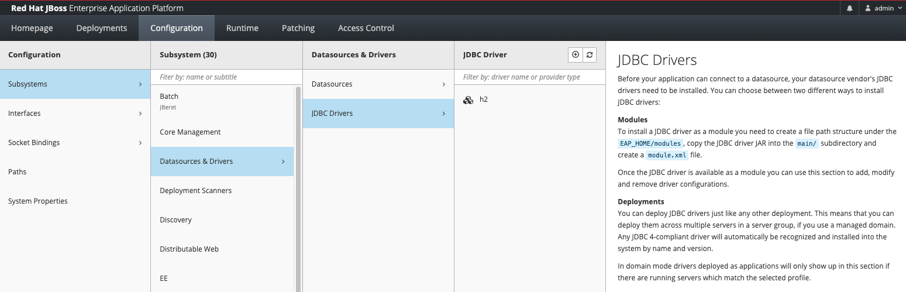

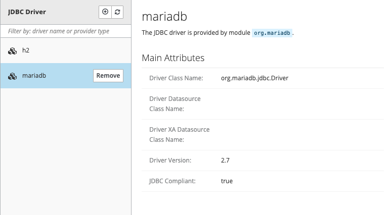
 
## 1.2 CLI을 이용한 JDBC 모듈 로딩
```
# ./jboss-cli.sh --connect
[standalone@localhost:9990 /] /subsystem=datasources/jdbc-driver=mariadb:add(driver-name=mariadb,driver-module-name=org.mariadb,driver-xa-datasource-class-name=org.mariadb.jdbc.MySQLDataSource, driver-class-name=org.mariadb.jdbc.Driver)

[standalone@localhost:9990 /] /subsystem=datasources/jdbc-driver=mariadb:read-resource
{
    "outcome" => "success",
    "result" => {
        "deployment-name" => undefined,
        "driver-class-name" => undefined,
        "driver-datasource-class-name" => undefined,
        "driver-major-version" => undefined,
        "driver-minor-version" => undefined,
        "driver-module-name" => "org.mariadb",
        "driver-name" => "mariadb",
        "driver-xa-datasource-class-name" => "org.mariadb.jdbc.MySQLDataSource",
        "jdbc-compliant" => undefined,
        "module-slot" => undefined,
        "profile" => undefined,
        "xa-datasource-class" => undefined
    }
}
```

## 1.3 HTTP management API를 이용한 JDBC 모듈 로딩
* CURL 을 이용한 예제
```
curl -u admin:admin --digest -D - http://localhost:9990/management --header "Content-Type: application/json" -d '{"operation":"add", "address":["subsystem","datasources","jdbc-driver","mariadb"], "driver-name" : "mariadb" , "driver-module-name":"org.mariadb","driver-xa-datasource-class-name":"org.mariadb.jdbc.MySQLDataSource"," driver-class-name":"org.mariadb.jdbc.Driver" , "json.pretty":1}'  
```
* Postman 을 이용한 예제
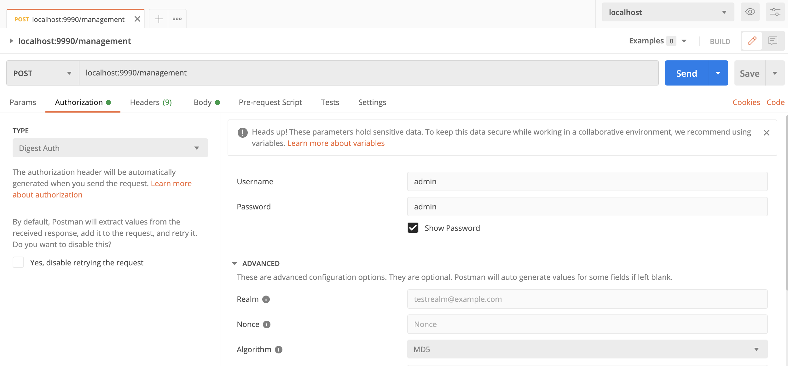
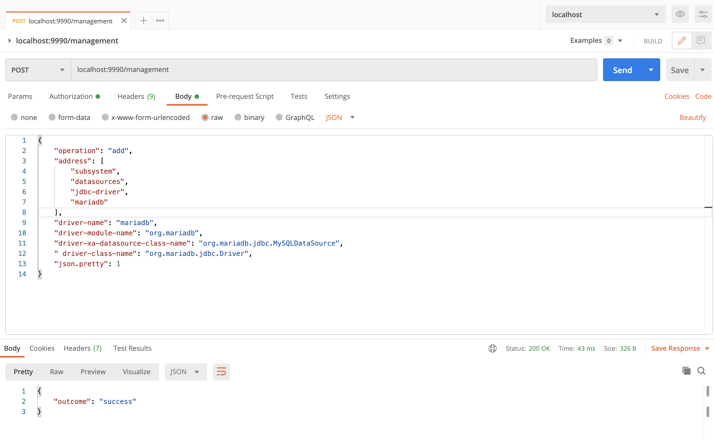

## 1.4 XML 을 이용한 JDBC 모듈 로딩
모든 방법의 설정 후에는 xml에 반영이 됩니다.
- standalone.xml > "datasources" > "drivers" 속성 추가
```
<datasources>
  ...
  <drivers>
    <driver name="mariadb" module="org.mariadb">
      <driver-class>org.mariadb.jdbc.Driver</driver-class>
      <xa-datasource-class>org.mariadb.jdbc.MySQLDataSource</xa-datasource-class>
    </driver>
  </drivers>
</datasources>
```

# 2. Datasource 등록하기
## 2.1 GUI 를 이용한 Datasoruce 등록 
http://127.0.0.1:9990/console/index.html 관리자 콘솔에 로그인합니다. <BR/>
Configuration -> Subsystem -> Datasource & Drivers -> Datasources -> + [Add Datasource] 클릭

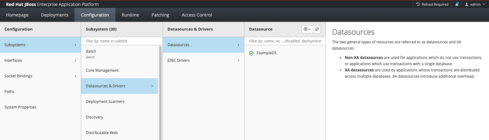

1. Choose Template : Custom 선택

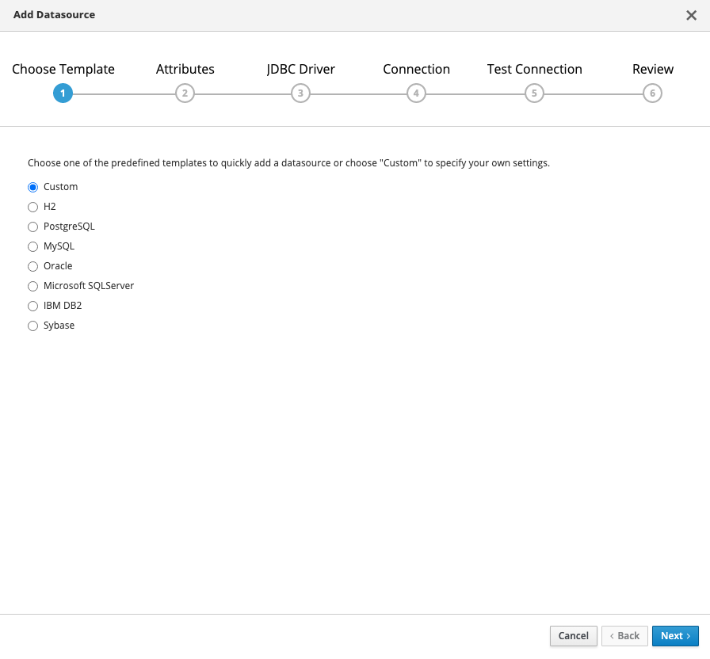

2. Attributes : <br/>

변수 | 값
------------ | -------------
Name | MariaDBDS
JNDI Name | java:jboss/MariaDBDS 

<br/>

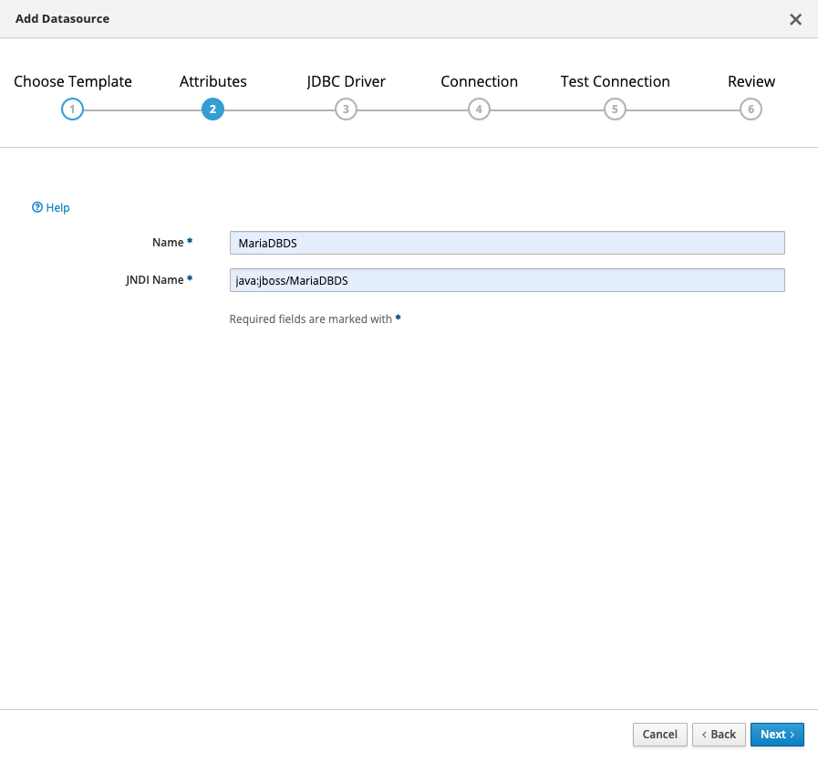

3. JDBC Driver : <br/>

변수 | 값
------------ | -------------
Driver Name | mariadb


4. Connection : <br/>

변수 | 값
------------ | -------------
Connection Url | jdbc:mariadb://database:3306/jbossdb
User Name | jboss
Password | jboss

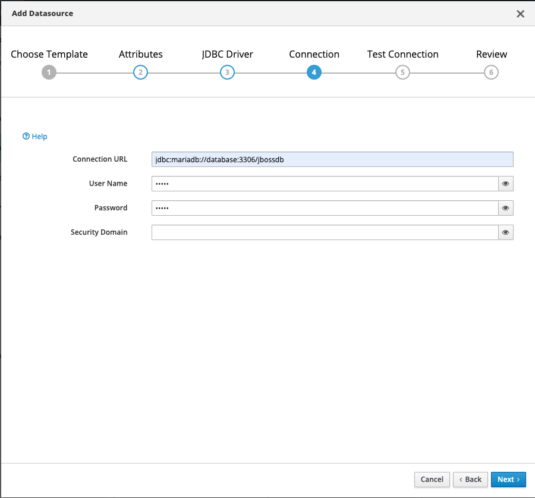

5. Test Connection : </br>

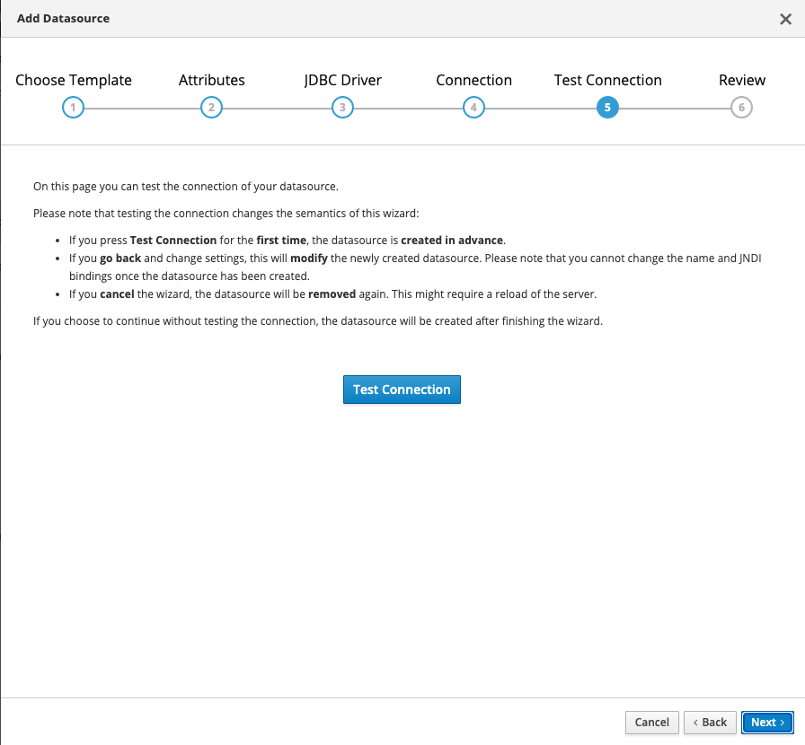
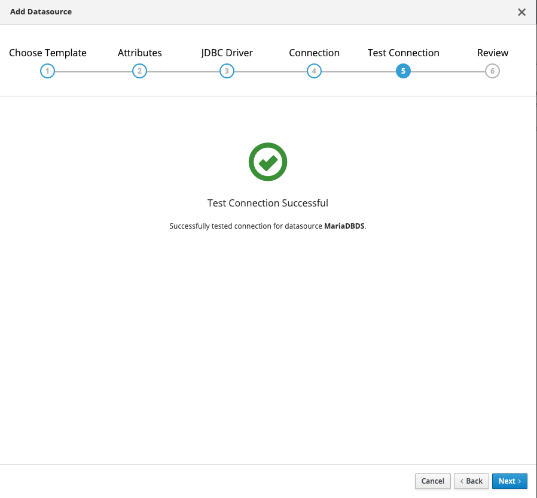

6. Review : </br>
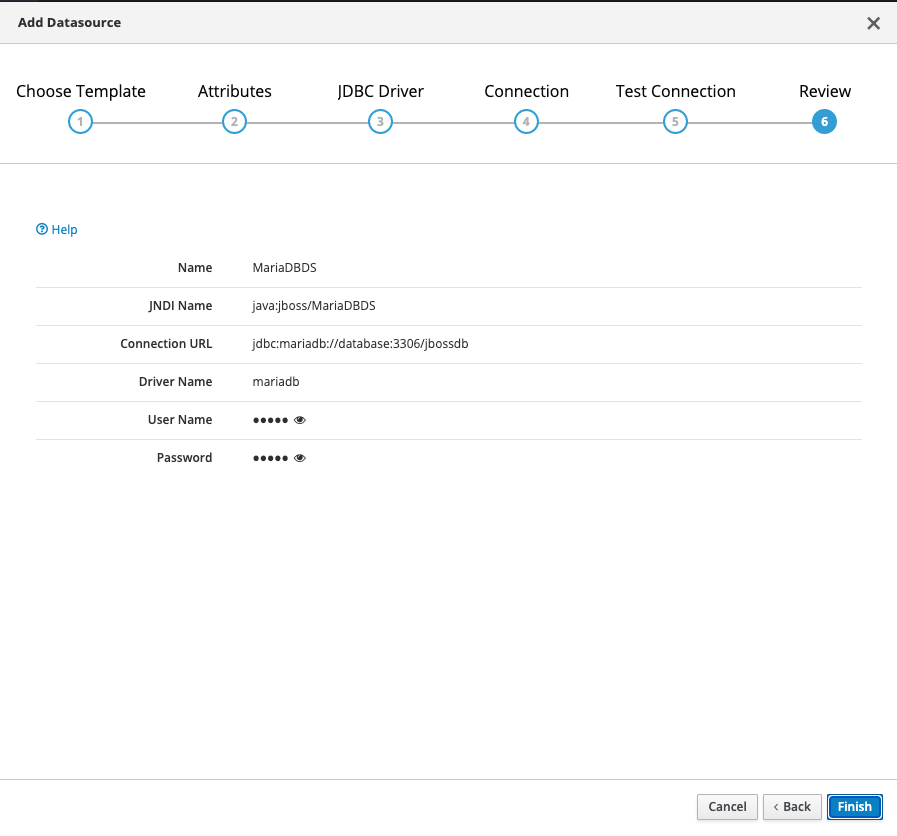
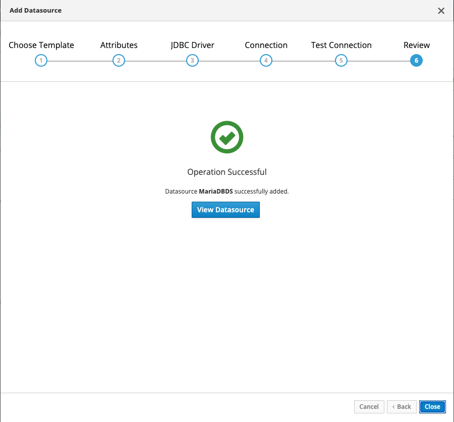

## 2.2 CLI 를 이용한 Datasoruce 등록
```
# ./jboss-cli.sh --connect
[standalone@localhost:9990 /] data-source add --name=MariaDBDS --jndi-name=java:jboss/MariaDBDS --driver-name=mariadb --connection-url=jdbc:mariadb://database:3306/jbossdb --user-name=jboss --password=jboss --validate-on-match=true --background-validation=false --valid-connection-checker-class-name=org.jboss.jca.adapters.jdbc.extensions.mysql.MySQLValidConnectionChecker --exception-sorter-class-name=org.jboss.jca.adapters.jdbc.extensions.mysql.MySQLExceptionSorter

[standalone@localhost:9990 /] /subsystem=datasources/data-source=MariaDBDS:read-resource
{
    "outcome" => "success",
    "result" => {
        "allocation-retry" => undefined,
        "allocation-retry-wait-millis" => undefined,
        "allow-multiple-users" => false,
        "authentication-context" => undefined,
        "background-validation" => false,
        "background-validation-millis" => undefined,
        "blocking-timeout-wait-millis" => undefined,
        "capacity-decrementer-class" => undefined,
        "capacity-decrementer-properties" => undefined,
        "capacity-incrementer-class" => undefined,
        ...
    }
}
```

## 2.3 HTTP management API 를 이용한 Datasoruce 등록
* CURL 을 이용한 예제
```
curl -u admin:admin --digest -D - http://localhost:9990/management --header "Content-Type: application/json" -d '{"operation":"add", "address":["subsystem","datasources","data-source","MariaDBDS"], "jndi-name" : "java:jboss/MariaDBDS" , "driver-name":"mariadb" ,"connection-url" : "jdbc:mariadb://database:3306/jbossdb" , "user-name" : "jboss" , "password" : "jboss" , "validate-on-match" : "true", "background-validation": "false" , "valid-connection-checker-class-name":"org.jboss.jca.adapters.jdbc.extensions.mysql.MySQLValidConnectionChecker" , "exception-sorter-class-name" : "org.jboss.jca.adapters.jdbc.extensions.mysql.MySQLExceptionSorter" , "json.pretty":1}'  
```
* Postman 을 이용한 예제


## 2.4 XML 을 이용한 Datasoruce 등록
모든 방법의 설정 후에는 xml에 반영이 됩니다.
- standalone.xml > "datasources" > "datasource" 속성 추가
```
<datasources>
  <datasource jndi-name="java:jboss/MariaDBDS" pool-name="MariaDBDS">
    <connection-url>jdbc:mariadb://localhost:3306/jbossdb</connection-url>
    <driver>mariadb</driver>
    <security>
      <user-name>jboss</user-name>
      <password>jboss</password>
    </security>
    <validation>
      <valid-connection-checker class-name="org.jboss.jca.adapters.jdbc.extensions.mysql.MySQLValidConnectionChecker"/>
      <validate-on-match>true</validate-on-match>
      <background-validation>false</background-validation>
      <exception-sorter class-name="org.jboss.jca.adapters.jdbc.extensions.mysql.MySQLExceptionSorter"/>
    </validation>
  </datasource>
  <drivers>
    <driver name="mariadb" module="org.mariadb">
      <driver-class>org.mariadb.jdbc.Driver</driver-class>
      <xa-datasource-class>org.mariadb.jdbc.MySQLDataSource</xa-datasource-class>
    </driver>
  </drivers>
</datasources>
```

# 3 Datasource DB 접속 테스트

## 3.1 GUI 를 이용한 접속 테스트
http://127.0.0.1:9990/console/index.html 관리자 콘솔에 로그인합니다. <BR/>
Configuration -> Subsystem -> Datasource & Drivers -> Datas08rces -> MariaDBDS -> View -> Test Connection
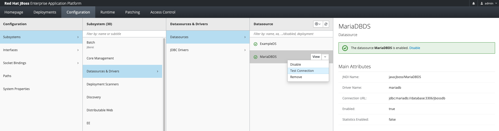

## 3.2 CLI 를 이용한 접속 테스트
```
# ./jboss-cli.sh --connect

[standalone@localhost:9990 /] /subsystem=datasources/data-source=MariaDBDS:test-connection-in-pool()
{
    "outcome" => "success",
    "result" => [true]
}
```

## 3.1 HTTP management API 를 이용한 접속 테스트
* CURL 을 이용한 예제
```
curl -u admin:admin --digest -D - http://localhost:9990/management --header "Content-Type: application/json" -d '{"operation":"test-connection-in-pool", "address":["subsystem","datasources","data-source","MariaDBDS"], "json.pretty":1}'  
```
* Postman 을 이용한 예제

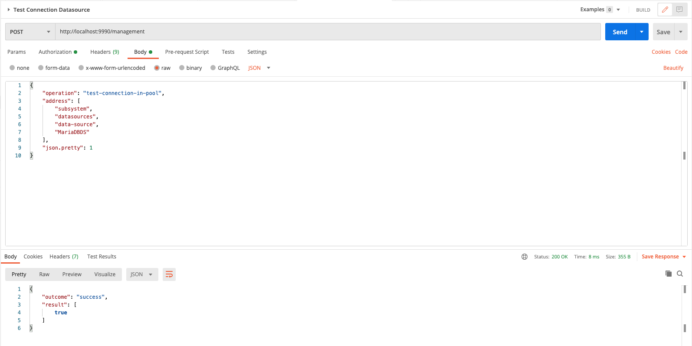

