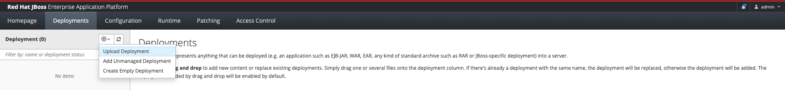
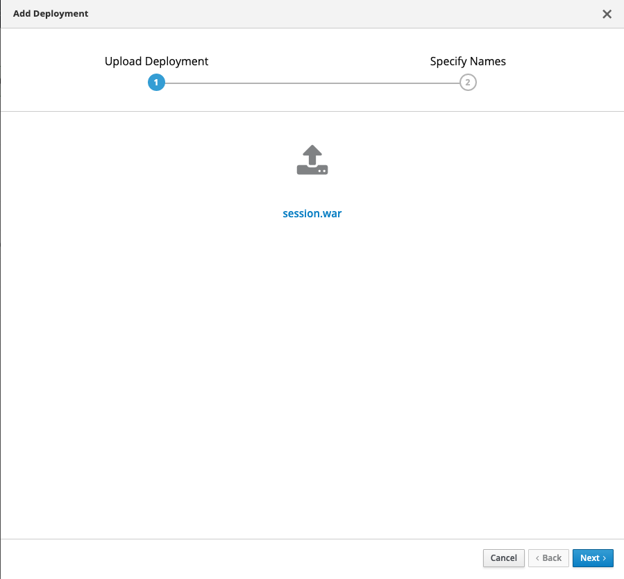
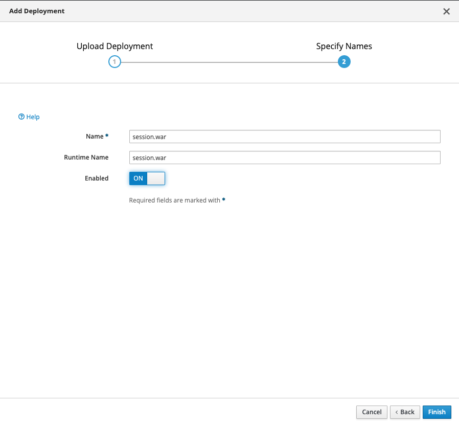
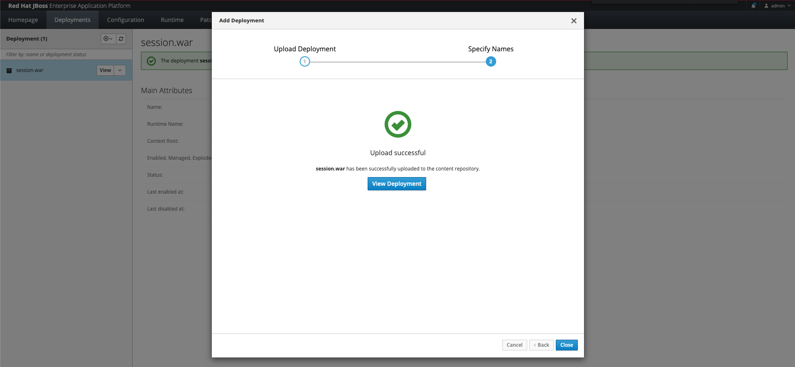
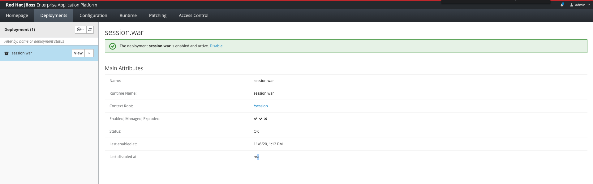
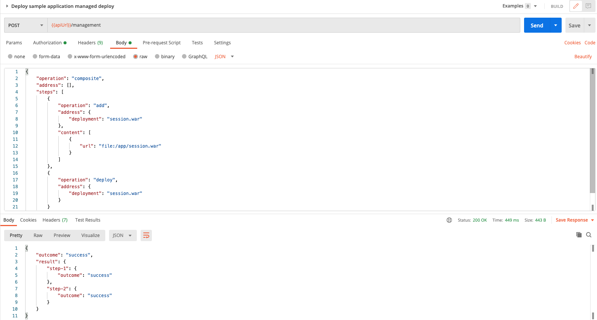
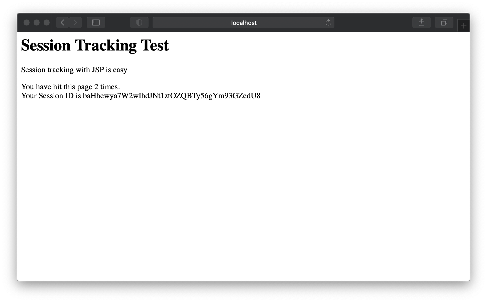
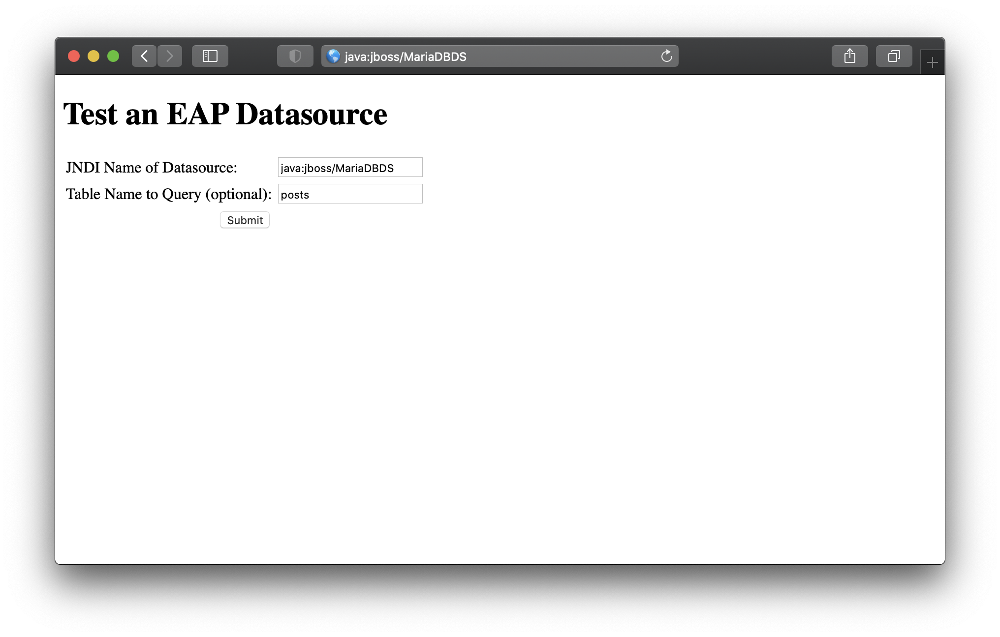

# JBoss 어플리케이션 배포하기

### 목차 
---
1. [사전설치](./01.Install.md#1-사전-설치)
   1. [docker 설치](./01.Install.md#11-docker-설치)
   2. [docker-compose 설치](./01.Install.md#12-docker-compose-설치) 
2. [JBoss Docker 이미지 만들기](./01.Install.md#2-jboss-docker-이미지-만들기)
   1. [Dockerfile 만들기](./01.Install.md#21-dockerfile-만들기)
   2. [docker 빌드로 이미지 만들기](./01.Install.md#22-docker-빌드로-이미지-만들기)
   3. [docker 컨테이너 기동하기](./01.Install.md#23-docker-컨테이너-기동하기)
   4. [docker 컨테이너 사용법](./01.Install.md#23-docker-컨테이너-기동하기)
---
<br/><br/>

# 1. docker-compose 설정 하기
docker-compose 를 이용하여 JBoss 컨테이너와 mariadb 컨테이너를 동작합니다.
[docker-compose 파일 보기](https://raw.githubusercontent.com/nationminu/jboss-demo/master/docker-compose.yaml)

## 1.1 docker-compose.yaml 스크립트 작성
> 1. JBoss Standalone 컨테이너를 기동합니다.
> 2. mariadb 를 기동하고 데이터베이스와 유저를 생성하고 샘플 데이터를 입력합니다.
> database 스키마와 데이터는 database/init 아래에 sql 파일이 존재합니다.

```
---
version: "3.3"
services:
#--------------------------------------------------------------------------#
#--------------------------------------------------------------------------#
#            J B O S S E A P  v7.3.0  /  W I L D F L Y  v18.0.1            #
#--------------------------------------------------------------------------#
#--------------------------------------------------------------------------#

#--------------------------------------------------------------------------#
#                       S T A N D A L O N E  M O D E                       #
#--------------------------------------------------------------------------#
    standalone:
        build: ./build
        image: "local/jboss-eap:7.3"
        #image: "local/wildfly:18.0.1"
        ports:
            - "8080:8080"
            - "9990:9990"
        environment:
            - "TZ=Asia/Seoul"   
            - "JAVA_OPTS=-Xms1024m -Xmx1024m -Djboss.bind.address=0.0.0.0 -Djboss.bind.address.management=0.0.0.0 -Djboss.server.default.config=standalone.xml -Djava.net.preferIPv4Stack=true"
        entrypoint: ["./bin/standalone.sh"]   

#--------------------------------------------------------------------------#
#                          D O M A I N  M O D E                            #
#--------------------------------------------------------------------------#
    # master:
    #     build: ./build
    #     image: "local/jboss-eap:7.3"
    #     #image: "local/wildfly:18.0.1"
    #     ports:
    #         - "8080:8080"
    #         - "8180:8180"
    #         - "9990:9990"
    #     environment:
    #         - "TZ=Asia/Seoul"   
    #         - "JAVA_OPTS=-Xms256m -Xmx512m -Djava.net.preferIPv4Stack=true"   

    # slave:
    #     build: ./build
    #     image: "local/jboss-eap:7.3"
    #     #image: "local/wildfly:18.0.1"
    #     ports:
    #         - "18080:8080"
    #         - "18180:8180" 
    #     environment:
    #         - "TZ=Asia/Seoul"   
    #         - "JAVA_OPTS=-Xms256m -Xmx512m -Djboss.domain.master.address=master -Djboss.host.default.config=host-slave.xml -Djava.net.preferIPv4Stack=true" 

#--------------------------------------------------------------------------#
#--------------------------------------------------------------------------#
#                             M A R I A D B  v10.5                         #
#--------------------------------------------------------------------------#
#--------------------------------------------------------------------------#   
    database:
        image: mariadb:10.5
        environment: 
            TZ: "Asia/Seoul"
            MYSQL_ROOT_PASSWORD: jboss
            MYSQL_DATABASE: jbossdb
            MYSQL_USER: jboss
            MYSQL_PASSWORD: jboss
        volumes:
            - ./database/data:/var/lib/mysql:rw 
            - ./database/init:/docker-entrypoint-initdb.d:rw
```
## 1.2 docker-compose 실행하기
build 디렉토리에 설정되어 있는 docker build 를 실행하면서 컨테이너를 기동합니다.
> docker-compose down/kill 로 종료/강제종료 가능합니다.
```
# docker-compose up --build
```

## 1.3 docker-compose 상태 확인
jboss_standalone 과 jboss_database 의 상태를 확인합니다.
```
# docker-compose ps
       Name                    Command             State                            Ports
-------------------------------------------------------------------------------------------------------------------
jboss_database_1     docker-entrypoint.sh mysqld   Up      3306/tcp
jboss_standalone_1   ./bin/standalone.sh           Up      8009/tcp, 0.0.0.0:8080->8080/tcp, 0.0.0.0:9990->9990/tcp
```

# 2. 샘플 어플리케이션 배포하기 
Session 테스트 페이지, 디비 연동 테스트 페이지를 포함한 샘플 어플리케이션을 배포합니다.<br/>
어플리케이션은 배포 자료에 포함되어 있는 "build/session.war" 사용 할 수 있으며 소스 코드는 https://github.com/nationminu/sample.war 확인가능힙니다.
본 실습에서는 docker build 시 컨테이너 안에 배포됩니다. 
* 사전에 Datasource 설정이 필요합니다.

## 2.2 GUI 를 이용한 배포 
http://127.0.0.1:9990/console/index.html 관리자 콘솔에 로그인합니다. <BR/>
Deployments > + [Upload Depoyment]
> * Upload Delpoyment : 압축된 형태의 어플리케이션을 업로드해서 배포 GUI 모드에서만 사용가능
> * Add Unmanaged Deployment : 서버에 미리 업로드 어플리케이션의 위치를 이용하여 배포
> * Create Empty Deployment : 비어 있는 배포 생성. 이후 원하는 컨텐츠를 업로드







## 2.3 CLI 를 이용한 배포
서버에 미리 업로드 되어 있는 어플리케이션 배포만 사용가능
> 어플리케이션을 jboss로 복사하여 관리하는 managed 와 어플리케이션 위치를 지정하는 unmanaged 모드를 사용하여 배포 가능합니다.
```
[standalone@localhost:9990 /] deploy --name=session.war --runtime-name=session.war /app/session.war [--unmanaged]
[standalone@localhost:9990 /] deployment-info
NAME        RUNTIME-NAME PERSISTENT ENABLED STATUS
session.war session.war  true       true    OK
```

## 2.4 HTTP management API 를 이용한 배포
서버에 미리 업로드 되어 있는 어플리케이션 배포만 사용가능
> 어플리케이션을 jboss로 복사하여 관리하는 managed 와 어플리케이션 위치를 지정하는 unmanaged 모드를 사용하여 배포 가능합니다.
- CURL 을 이용한 예제
```
# managed
curl -u admin:admin --digest -L -D - http://localhost:9990/management --header "Content-Type: application/json" -d '{"operation" : "composite", "address" : [], "steps" : [{"operation" : "add", "address" : {"deployment" : "session.war"}, "content" : [{"url" : "file:/app/session.war"}]},{"operation" : "deploy", "address" : {"deployment" : "session.war"}}],"json.pretty":1}'

# unmanaged
curl -u admin:admin --digest -L -D - http://localhost:9990/management --header "Content-Type: application/json" -d '{"operation" : "composite", "address" : [], "steps" : [{"operation" : "add", "address" : {"deployment" : "jpetstore.war"}, "content" : [{"path" : "/app/jpetstore-jdbc.war","archive" : "true"}]},{"operation" : "deploy", "address" : {"deployment" : "jpetstore.war"}}],"json.pretty":1}'
```
- Postman 을 이용한 예제



## 2.5 XML 을 이용한 배포
서버에 미리 업로드 되어 있는 어플리케이션 배포만 사용가능
> 어플리케이션을 jboss로 복사하여 관리하는 managed 와 어플리케이션 위치를 지정하는 unmanaged 모드를 사용하여 배포 가능합니다.
> 1. content : managed 모드에서 사용되며 data/content 아래에서 관리됨
> 2. fs-archive : unmanaged 모드에서 사용되며 압축된 어플리케이션
> 3. fs-exploded : unmanaged 모드에서 사용되며 디렉토리 구조의 어플리케이션
```
    <deployments>
        <deployment name="session.war" runtime-name="session.war">
            <content sha1="b2132b2297e9817518c77ebe1ed3d5faf97c3c8f"/>
        </deployment>
    </deployments>

    <deployments>
        <deployment name="session.war" runtime-name="session.war">
            <fs-archive path="/app/session.war"/>
        </deployment>
    </deployments>

    <deployments>
        <deployment name="session.war" runtime-name="session.war">
            <fs-exploded path="/app/session.war"/>
        </deployment>
    </deployments> 
```

## 2.5 배포 어플리케이션 확인
* Session 테스트 페이지 : http://localhost:8080/session/index.jsp

* Database 테스트 페이지 : http://localhost:8080/session/dstest.jsp


# 3. 스프링 프래임워크 디비 연결하기
Spring/Mybatis 샘플 어플리케이션인 jpetstore 를 사용하여 실제 디비와 연동하는 실습을 진행합니다. <br/>
GIT 명령어릉 이용하여 jpetstore를 다운로드 하고 빌드합니다. 빌드가 불가능한 환경은 배포 자료에 포함되어 있는 "build/jpetstore-jdbc.war" 를 사용합니다.
```
git clone https://github.com/mybatis/jpetstore-6.git
```

## 3.1 스프링 프레임워크(Jpetstore) 디비 연결 설정하기
스프링 프레임워크에서 기존 datasource 설정 파일을 JBoss Datasource 의 JNDI Lookup 할수 있게 변경합니다.
- ./jpetstore-6/src/main/webapp/WEB-INF/applicationContext.xml
기존 메모리 데이터소스 부분 삭제
```
 <!-- in-memory database and a datasource --> 
 <!--
    <jdbc:embedded-database id="dataSource">
        <jdbc:script location="classpath:database/jpetstore-hsqldb-schema.sql"/>
        <jdbc:script location="classpath:database/jpetstore-hsqldb-dataload.sql"/>
    </jdbc:embedded-database>
-->
```
- JBoss 에서 등록된 datasource jndi 추가
```
<!-- mariadb database -->
<bean id="dataSource" class="org.springframework.jndi.JndiObjectFactoryBean">
	<property name="jndiName">
		<value>java:jboss/MariaDBDS</value>
	</property>
</bean>
```
> maven 패키지로 구성되어 있어 빌드할 경우 java 와 maven 이 필요합니다. <br/>
> 아래와 같이 docker maven 이미지로 java 와 maven 패키지 설치 없이 빌드 할수 있습니다.
```
#!/usr/bin/env bash

docker run -v "${PWD}:/usr/app/myapp" -v "${PWD}/m2/:/root/.m2/" -w /usr/app/myapp maven:3-jdk-8 mvn clean install -DskipTests
```

## 3.2 스프링 프레임워크(Jpetstore) 배포
> 2. 샘플 어플리케이션 배포하기 를 참고하여 어플리케이션을 배포하세요.

## 3.2 스프링 프레임워크(Jpetstore) 테스트


### 4.2 jpetstore 

- 스프링 프래임워크 jdbc 설정

- [x] ./jpetstore-6/src/main/webapp/WEB-INF/applicationContext.xml
기존 메모리 데이터소스 부분 삭제
```
 <!-- in-memory database and a datasource --> 
 <!--
    <jdbc:embedded-database id="dataSource">
        <jdbc:script location="classpath:database/jpetstore-hsqldb-schema.sql"/>
        <jdbc:script location="classpath:database/jpetstore-hsqldb-dataload.sql"/>
    </jdbc:embedded-database>
-->
```

- [x] JBoss 에서 등록된 datasource jndi 추가
```
<!-- mariadb database -->
<bean id="dataSource" class="org.springframework.jndi.JndiObjectFactoryBean">
	<property name="jndiName">
		<value>java:jboss/MariaDBDS</value>
	</property>
</bean>
```

- 스프링 프래임워크 빌드
```
docker run -v "${PWD}:/usr/app/myapp" -v "${PWD}/m2/:/root/.m2/" -w /usr/app/myapp maven:3-jdk-8 mvn install 
```

## 5. mariadb 설정 및 데이터 입력
- docker-compose.xml 내에 mariadb 설정 추가
```
    database:
        image: mariadb:10.5
        environment: 
            TZ: "Asia/Seoul"
            MYSQL_ROOT_PASSWORD: jboss
            MYSQL_DATABASE: jbossdb
            MYSQL_USER: jboss
            MYSQL_PASSWORD: jboss
        volumes:
            - ./database/data:/var/lib/mysql:rw 
            - ./database/init:/docker-entrypoint-initdb.d:rw  
```

### mariadb 용 스키마 및 데이터 입력
docker 실행시 자동으로 설정된 데이터베이스, 사용자 정보, 스키마 및 데이터를 생성합니다.

- [x] [jpetstore mysql schema](https://raw.githubusercontent.com/nationminu/jboss-demo/master/database/init/1.%20jpetstore-mysql-schema.sql) 다운로드
```bash
wget https://raw.githubusercontent.com/nationminu/jboss-demo/master/database/init/1.%20jpetstore-mysql-schema.sql
```
- [x] [jpetstore mysql data](https://raw.githubusercontent.com/nationminu/jboss-demo/master/database/init/2.%20jpetstore-mysql-dataload.sql) 다운로드
```bash
wget https://raw.githubusercontent.com/nationminu/jboss-demo/master/database/init/2.%20jpetstore-mysql-dataload.sql
```
- [x] 프로젝트 내 "./database/init" 디렉토리에 아래에 스키마 파일 과 데이터 파일을 복사 
