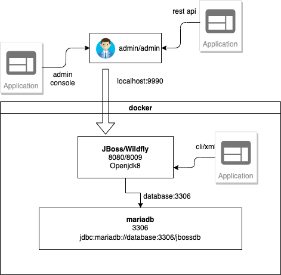

# JBoss/Wildfly Deployment Hands-on Demo

본 실습에 사용되는 소프트웨어 버전입니다.
* [docker](https://docs.docker.com/get-docker/) v19.03.13
* [docker-compose](https://docs.docker.com/compose) v1.27.4
* [openjdk 8](https://hub.docker.com/_/openjdk) docker 이미지
* [mariadb 10](https://hub.docker.com/_/mariadb) docker 이미지
* [jboss eap 7](https://access.redhat.com/products/red-hat-jboss-enterprise-application-platform/) 패키지
* [wildfly 18.0.1](https://www.wildfly.org/downloads/) 패키지 *optional

<br/>



<br/>

## 빌드/실행 방법
```
# git clone https://github.com/nationminu/jboss-demo.git

# cd jboss-demo
# docker-compose up --build
# docker-compose ps
       Name                    Command             State                            Ports
-------------------------------------------------------------------------------------------------------------------
jboss_database_1     docker-entrypoint.sh mysqld   Up      3306/tcp
jboss_standalone_1   ./bin/standalone.sh           Up      8009/tcp, 0.0.0.0:8080->8080/tcp, 0.0.0.0:9990->9990/tcp

# curl -u admin:admin --digest -D - http://localhost:9990/management 
HTTP/1.1 401 Unauthorized
Connection: keep-alive
WWW-Authenticate: Digest realm="ManagementRealm", nonce="AAAAAwAAAzTZdpvt0uiPvHo6ba1IVAMC3Cgbdo1SoFB9WsqydzZprXIhc3M=", opaque="00000000000000000000000000000000", algorithm=MD5, qop=auth
X-Frame-Options: SAMEORIGIN
Content-Length: 77
Content-Type: text/html
Date: Mon, 09 Nov 2020 02:10:42 GMT

HTTP/1.1 200 OK
Connection: keep-alive
X-Frame-Options: SAMEORIGIN
Content-Type: application/json; charset=utf-8
Content-Length: 3234
Date: Mon, 09 Nov 2020 02:10:42 GMT

{"management-major-version" : 10 ...
```
 
## Hands on 데모/실습 목차

#### 1. [도커에 JBoss/Wildfly 설치하기](01.Install.md) 
1. [사전설치](./01.Install.md#1-사전-설치)
   1. [docker 설치](./01.Install.md#11-docker-설치)
   2. [docker-compose 설치](./01.Install.md#12-docker-compose-설치) 
2. [JBoss Docker 이미지 만들기](./01.Install.md#2-jboss-docker-이미지-만들기)
   1. [Dockerfile 만들기](./01.Install.md#21-dockerfile-만들기)
   2. [docker 빌드로 이미지 만들기](./01.Install.md#22-docker-빌드로-이미지-만들기)
   3. [docker 컨테이너 기동하기](./01.Install.md#23-docker-컨테이너-기동하기)
   4. [docker 컨테이너 사용법](./01.Install.md#23-docker-컨테이너-기동하기)
---

#### 2. [JBoss 데이터소스 설정/연결 방법](02.Datasource.md)  
1. [JDBC 모듈 생성/로딩하기](./02.Datasource.md#1-jdbc-모둘-등록하기)
   1. [GUI를 이용한 JDBC 모듈로딩](./02.Datasource.md#11-gui-를-이용한-jdbc-모듈-로딩)
   2. [CLI을 이용한 JDBC 모듈 로딩](./02.Datasource.md#12-cli을-이용한-jdbc-모듈-로딩)
   3. [HTTP management API를 이용한 JDBC 모듈 로딩](./02.Datasource.md#13-http-management-api를-이용한-jdbc-모듈-로딩)
   4. [XML 을 이용한 JDBC 모듈 로딩](./02.Datasource.md#14-xml-을-이용한-jdbc-모듈-로딩)
2. [Datasource 등록하기](./02.Datasource.md#2-datasource-등록하기)
   1. [GUI 를 이용한 Datasoruce 등록](./02.Datasource.md#21-gui-를-이용한-datasoruce-등록)
   2. [CLI 를 이용한 Datasoruce 등록](./02.Datasource.md#22-cli-를-이용한-datasoruce-등록)
   3. [HTTP management API 를 이용한 Datasoruce 등록](./02.Datasource.md#23-http-management-api-를-이용한-datasoruce-등록)
   4. [XML 을 이용한 Datasoruce 등록](./02.Datasource.md#24-xml-을-이용한-datasoruce-등록)
---   

#### 3. [JBoss 어플리케이션 배포 방법](03.Deployment.md)  
1. [docker-compose 설정 하기](./03.Deployment.md#1-docker-compose-설정-하기)
   1. [docker-compose.yaml 스크립트 작성](./03.Deployment.md#11-docker-composeyaml-스크립트-작성)
   2. [docker-compose 실행하기](./03.Deployment.md#12-docker-compose-실행하기) 
   3. [docker-compose 상태 확인](./03.Deployment.md#13-docker-compose-상태-확인) 
2. [샘플 어플리케이션 배포하기](./03.Deployment.md#2-샘플-어플리케이션-배포하기)
   1. [Deployment Scanner 를 이용한 배포](./03.Deployment.md#21-deployment-scanner-를-이용한-배포)
   2. [GUI 를 이용한 배포](./03.Deployment.md#22-gui-를-이용한-배포)
   3. [CLI 를 이용한 배포](./03.Deployment.md#23-cli-를-이용한-배포)
   4. [HTTP management API 를 이용한 배포](./03.Deployment.md#24-http-management-api-를-이용한-배포)
   5. [XML 을 이용한 배포](./03.Deployment.md#25-xml-을-이용한-배포)
3. [스프링 프래임워크 디비 연결하기](./03.Deployment.md#3-스프링-프래임워크-디비-연결하기)
   1. [스프링 프레임워크(Jpetstore) 디비 연결 설정하기](./03.Deployment.md#31-스프링-프레임워크jpetstore-디비-연결-설정하기)
   2. [스프링 프레임워크(Jpetstore) 배포](./03.Deployment.md#32-스프링-프레임워크jpetstore-배포)
   3. [스프링 프레임워크(Jpetstore) 테스트](./03.Deployment.md#32-스프링-프레임워크jpetstore-테스트)
---

# Reference
* [docker](https://www.docker.com/)
* [docker-compose](https://docs.docker.com/compose/)
* [openjdk](https://hub.docker.com/_/openjdk)
* [JBoss EAP](https://www.redhat.com/en/technologies/jboss-middleware/application-platform)
* [Wildfly](https://www.wildfly.org/)
