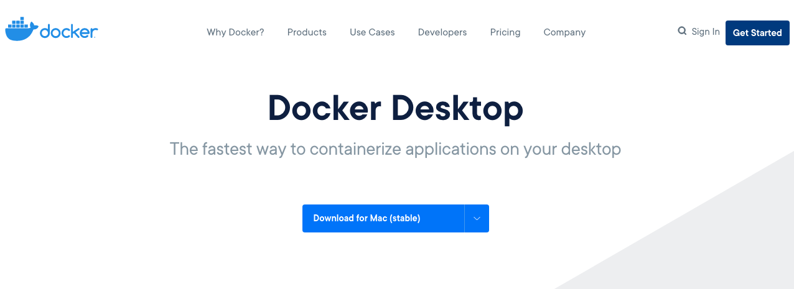
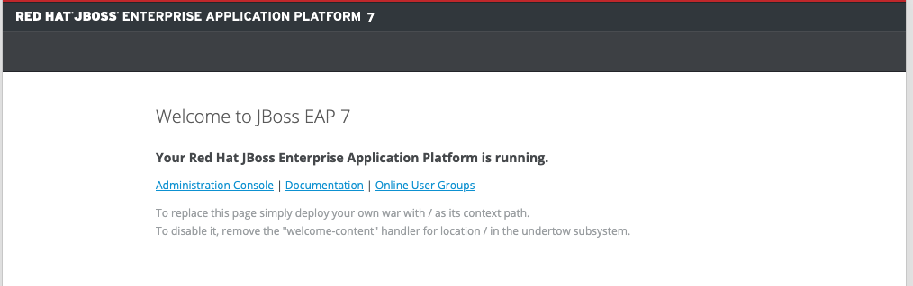
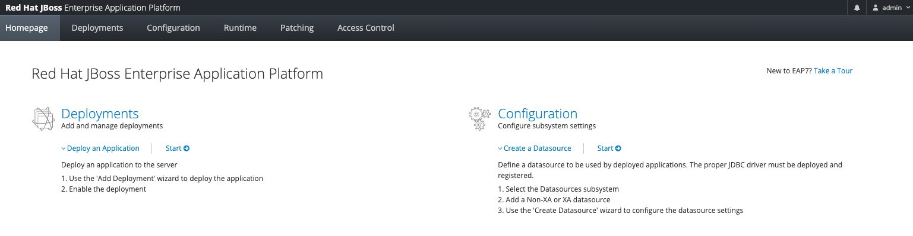

# JBoss/Wildfly Deployment Hands-on Demo


본 실습에 사용되는 소프트웨어 버전입니다.
- [docker](https://docs.docker.com/get-docker/) v19.03.13
- [docker-compose](https://docs.docker.com/compose) v1.27.4
- [openjdk 8](https://hub.docker.com/_/openjdk) docker 이미지
- [mariadb 10](https://hub.docker.com/_/mariadb) docker 이미지
- [jboss eap 7](https://access.redhat.com/products/red-hat-jboss-enterprise-application-platform/) 패키지
- [wildfly 18.0.1](https://www.wildfly.org/downloads/) 패키지 *Optional

<br/>

## 사전 설치 

> 본 실습은 docker 환경으로 구성되어 있습니다. 인터넷이 가능한 환경과 docker가 설치된 실습환경이 필요합니다. <br/>
> docker 실습 환경은 [docker](https://docs.docker.com/get-docker/)에서 확인하여 사전에 설치합니다. 
> 윈도우와 맥은 docker desktop 으로 설치합니다. 리눅스는 배포판에 맞는 명령어로 설치합니다. 또한 리눅스 환경에서는 docker-compose 가 설치되어 있지 않습니다. 추가 설치가 필요합니다. 

- [x] 윈도우/맥 [docker](https://docs.docker.com/get-docker/) 설치하기



- [x] 리눅스 [docker-compose](https://docs.docker.com/compose/install/) 설치하기

```bash
sudo curl -L "https://github.com/docker/compose/releases/download/1.27.4/docker-compose-$(uname -s)-$(uname -m)" -o /usr/local/bin/docker-compose
sudo chmod +x /usr/local/bin/docker-compose

$ docker-compose --version
docker-compose version 1.27.4, build 1110ad01
```  

<br /><br />

## 1. JBoss 설치
JBoss Docker 이미지를 생성하기 위해 [openjdk 8](https://hub.docker.com/_/openjdk) 버전의 docker 베이스 이미지를 사용합니다.
docker 의 기본 사용 방법은 [docker 따라하기](https://github.com/nationminu/docker-starter/blob/master/STARTER.md)를 참조하시기 바랍니다. 

### Dockerfile 만들기

로컬에 Docker 이미지를 만들기 위해 Dockerfile 을 생성합니다. Dockerfile 를 이용하여 컨테이너를 사용할 수 있도록 설정하고 빌드합니다. <br />
본 실습에서 사용되는 JBoss EAP 7.3(upstream version -> Wildfly 18.0.1)버전은 jdk8 이상에서 동작합니다. => [jboss support configuration](https://access.redhat.com/articles/2026253#EAP_73) 확인하기

- [x] [dockerhub](https://hub.docker.com/) 에서 컨테이너를 만들기 위한 "FROM" 명령으로 베이스 이미지 "openjdk 8" 을 지정합니다. 로컬에 베이스 이미지가 없을 경우 다운로드 합니다. 베이스 이미지를 다운받는 명령어로는 docker pull 을 사용할 수 있습니다.
```
FROM openjdk:8
```
- [x] JBOSS 디렉토리 경로와 추가 모듈 경로를 컨테이너 환경설정에 등록합니다. 추가 모듈 경로에는 mariadb 연결을 위한 jdbc 드라이버가 추가됩니다.
```
ENV JBOSS_HOME=/usr/local/jboss-eap-7.3
ENV JBOSS_MODULEPATH=${JBOSS_HOME}/modules:/app/modules.ext/
```
- [x] 다운로드 받은 JBoss 패키지를 컨터이너 내부로 COPY명령으로 복사합니다. ADD 명령도도 사용 가능하며, ADD 는 원격에 있는 파일도 복사할수 있습니다.(ex> ADD https://download.jboss.org/wildfly/18.0.1.Final/wildfly-18.0.1.Final.zip /usr/local)
```
COPY jboss-eap-7.3.0.zip /usr/local/
```
- [x] 복사한 JBoss 패키지의 압축을 해제하고 기동에 필요한 환경설정을 진행합니다.
1. JBoss 관리자 추가(admin/admin)
2. 샘플 어플리케이션(jpetstore 스프링 프래임워크) 및 mariadb jdbc 모듈 복사
3. domain 모드를 사용하기 위한 설정파일 복사
```
RUN cd /usr/local && unzip jboss-eap-7.3.0.zip && rm -f jboss-eap-7.3.0.zip
RUN cd ${JBOSS_HOME}/bin && ./add-user.sh admin admin 

RUN mkdir -p /app
COPY session.war /app/session.war 
COPY jpetstore.war /app/jpetstore.war 
COPY jpetstore-jdbc.war /app/jpetstore-jdbc.war
COPY modules.ext /app/modules.ext
COPY eap/*.xml /usr/local/jboss-eap-7.3/domain/configuration/
```
- [x] docker 컨테이너 내부의 작업디렉터리(WORKDIR)를 하고, 컨테이너 기동시 활성화(EXPOSE)할 포트를 설정합니다.
```
WORKDIR $JBOSS_HOME

EXPOSE 8080
EXPOSE 8009
EXPOSE 9990
```
- [x] docker 컨테이너 실행시 작동될 명령어를 설정합니다. ENTRYPOINT 는 컨테이너가 최종적으로 실행할 명령어를 실행합니다. JBoss 도메인 모드 기등올 위한 스크립트를 추가합니다.
``` 
ENTRYPOINT["./entrypoint.sh"]
```
- entrypoint.sh 
```
#!/usr/bin/env bash
CONTAINER_IP=`hostname -I`
${JBOSS_HOME}/bin/domain.sh -Djboss.bind.address=${CONTAINER_IP} -Djboss.bind.address.management=${CONTAINER_IP}
```
- 완성된 Dockerfile
```
FROM openjdk:8
#--------------------------------------------------------------------------#
#--------------------------------------------------------------------------#
#                      J B O S S E A P  v7.3.0  I M A G E                  #
#--------------------------------------------------------------------------#
#--------------------------------------------------------------------------#   
LABEL maintainer="mwsong@rockplace.co.kr"

ENV JBOSS_HOME=/usr/local/jboss-eap-7.3
ENV JBOSS_MODULEPATH=${JBOSS_HOME}/modules:/app/modules.ext/

COPY jboss-eap-7.3.0.zip /usr/local/

RUN cd /usr/local && unzip jboss-eap-7.3.0.zip && rm -f jboss-eap-7.3.0.zip
RUN cd ${JBOSS_HOME}/bin && ./add-user.sh admin admin 

RUN mkdir -p /app
COPY session.war /app/session.war 
COPY jpetstore.war /app/jpetstore.war 
COPY jpetstore-jdbc.war /app/jpetstore-jdbc.war
COPY modules.ext /app/modules.ext
COPY eap/*.xml /usr/local/jboss-eap-7.3/domain/configuration/
COPY entrypoint.sh ${JBOSS_HOME}

RUN chmod +x ${JBOSS_HOME}/entrypoint.sh 
 
WORKDIR $JBOSS_HOME

EXPOSE 8080
EXPOSE 8009
EXPOSE 9990
 
#CMD ["./bin/standalone.sh"]
ENTRYPOINT ["./entrypoint.sh"] 
```

- [x] 최종 완성된 Dockerfile을 이용하여 JBoss 컨테이너 이미지를 생성합니다.
```
## docker build -t [이미지이름]:[태그] [Dockerfile 위치]
# docker build -t local/jboss:7.3 .

# docker images
REPOSITORY                 TAG                 IMAGE ID            CREATED             SIZE
local/jboss                7.3                 449e09bcbceb        About an hour ago   987MB
```

- [x] 컨테이너 기동 및 기동 옵션
1. --rm : 컨테이너 종료시 컨테이너 삭제
2. --entrypoint : entrypoint 설정, 생성한 이미지는 domain 모드로 실행되기 때문에 entrypoint 를 초기화 하고 standalone 모드로 실행
3. -p : 컨테이너 포트 바인딩 => "[로컬포트]:[컨테이너포트]"
4. -v : 로컬 디렉토리를 컨테이너내 마운트 => "[로컬볼륨]:[컨테이너볼륨]"
5. -d : 백그라운드로 컨테이너 실행
```
## docker run [옵션] [이미지이름]:[태그] [명령어]
# docker run --rm --entrypoint '' -p 8080:8080 -p 9990:9990 local/jboss:7.3 ./bin/standalone.sh -b 0.0.0.0 -bmanagement 0.0.0.0
=========================================================================

  JBoss Bootstrap Environment

  JBOSS_HOME: /usr/local/jboss-eap-7.3

  JAVA: /usr/local/openjdk-8/bin/java

  JAVA_OPTS:  -server -verbose:gc -Xloggc:"/usr/local/jboss-eap-7.3/standalone/log/gc.log" -XX:+PrintGCDetails -XX:+PrintGCDateStamps -XX:+UseGCLogFileRotation -XX:NumberOfGCLogFiles=5 -XX:GCLogFileSize=3M -XX:-TraceClassUnloading -Xms1303m -Xmx1303m -XX:MetaspaceSize=96M -XX:MaxMetaspaceSize=256m -Djava.net.preferIPv4Stack=true -Djboss.modules.system.pkgs=org.jboss.byteman -Djava.awt.headless=true 

=========================================================================
....
03:32:59,456 INFO  [org.jboss.as] (Controller Boot Thread) WFLYSRV0060: Http management interface listening on http://0.0.0.0:9990/management
03:32:59,457 INFO  [org.jboss.as] (Controller Boot Thread) WFLYSRV0051: Admin console listening on http://0.0.0.0:9990
03:32:59,457 INFO  [org.jboss.as] (Controller Boot Thread) WFLYSRV0025: JBoss EAP 7.3.0.GA (WildFly Core 10.1.2.Final-redhat-00001) started in 3514ms - Started 315 of 577 services (369 services are lazy, passive or on-demand)
```

1. http://localhost:8080 확인


2. http://localhost:9990 확인 : 로그인정보(admin/admin)


- [x] 컨테이너 확인/로그확인
```
# docker ps [-a]
CONTAINER ID        IMAGE               COMMAND                  CREATED             STATUS              PORTS                                                      NAMES
fc6be36698ce        jboss_master        "./bin/standalone.sh…"   4 minutes ago       Up 4 minutes        0.0.0.0:8080->8080/tcp, 8009/tcp, 0.0.0.0:9990->9990/tcp   eloquent_gould

docker logs fc6be36698ce [-f]
```
- [x] 컨테이너 종료/강제종료/삭제
```
# docker stop fc6be36698ce
# docker kill fc6be36698ce
# docker rm  fc6be36698ce
```
---

## 2. JBoss 관리콘솔 접속하기 
```

```

## 3. JBoss 디비 설정하기 
```

```

## 4. 샘플어플리케이션 배포

### 4.1 session.war
```
```

### 4.2 jpetstore 
- 샘플 스프링 프레임워크(jpetstore) 다운로드 
```
git clone https://github.com/mybatis/jpetstore-6.git
```

- 스프링 프래임워크 jdbc 설정

- [x] ./jpetstore-6/src/main/webapp/WEB-INF/applicationContext.xml
기존 메모리 데이터소스 부분 삭제
```
 <!-- in-memory database and a datasource --> 
 <!--
    <jdbc:embedded-database id="dataSource">
        <jdbc:script location="classpath:database/jpetstore-hsqldb-schema.sql"/>
        <jdbc:script location="classpath:database/jpetstore-hsqldb-dataload.sql"/>
    </jdbc:embedded-database>
-->
```

- [x] JBoss 에서 등록된 datasource jndi 추가
```
<!-- mariadb database -->
<bean id="dataSource" class="org.springframework.jndi.JndiObjectFactoryBean">
	<property name="jndiName">
		<value>java:jboss/MariaDBDS</value>
	</property>
</bean>
```

- 스프링 프래임워크 빌드
```
docker run -v "${PWD}:/usr/app/myapp" -v "${PWD}/m2/:/root/.m2/" -w /usr/app/myapp maven:3-jdk-8 mvn install 
```

## 5. mariadb 설정 및 데이터 입력
- docker-compose.xml 내에 mariadb 설정 추가
```
    database:
        image: mariadb:10.5
        environment: 
            TZ: "Asia/Seoul"
            MYSQL_ROOT_PASSWORD: jboss
            MYSQL_DATABASE: jbossdb
            MYSQL_USER: jboss
            MYSQL_PASSWORD: jboss
        volumes:
            - ./database/data:/var/lib/mysql:rw 
            - ./database/init:/docker-entrypoint-initdb.d:rw 
            - ./database/log:/var/log/mysq:rw
```

### mariadb 용 스키마 및 데이터 입력
docker 실행시 자동으로 설정된 데이터베이스, 사용자 정보, 스키마 및 데이터를 생성합니다.

- [x] [jpetstore mysql schema](https://raw.githubusercontent.com/nationminu/jboss-demo/master/database/init/1.%20jpetstore-mysql-schema.sql) 다운로드
```bash
wget https://raw.githubusercontent.com/nationminu/jboss-demo/master/database/init/1.%20jpetstore-mysql-schema.sql
```
- [x] [jpetstore mysql data](https://raw.githubusercontent.com/nationminu/jboss-demo/master/database/init/2.%20jpetstore-mysql-dataload.sql) 다운로드
```bash
wget https://raw.githubusercontent.com/nationminu/jboss-demo/master/database/init/2.%20jpetstore-mysql-dataload.sql
```
- [x] 프로젝트 내 "./database/init" 디렉토리에 아래에 스키마 파일 과 데이터 파일을 복사 
